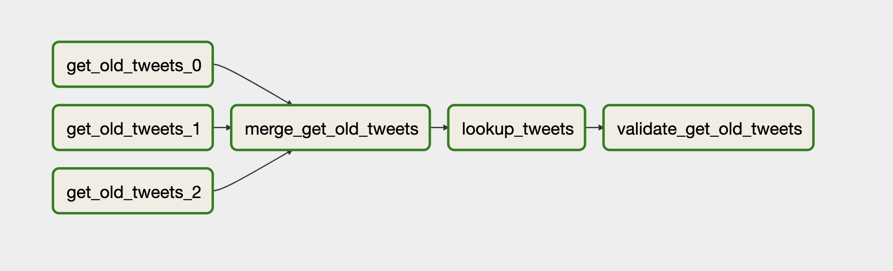
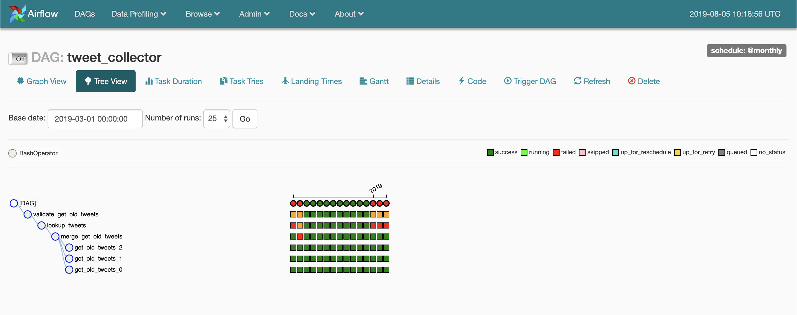

# Collect historical tweets with Airflow

This repository contains an [Airflow](https://airflow.apache.org/) workflow
for the collection of historical tweets based on a search query. The method
combines the package [getOldTweets3](https://github.com/Mottl/GetOldTweets3)
with the [Twitter status lookup API](https://developer.twitter.com/en/docs/tweets/post-and-engage/api-reference/get-statuses-lookup.html).
Airflow is used to programmatically author, schedule and monitor the 
collection process.

The [Twitter Standard Search API](https://developer.twitter.com/en/docs/tweets/search/api-reference/get-search-tweets.html)
searches against a sampling of recent Tweets published in the past 7 days.
Therefore, this API is not very useful to collect historical tweets.
The package getOldTweets3 is a webscraping package for Twitter that was 
developed to solve this problem. The package can ce used to collect
variables like "id", "permalink", "username", "to",
"text", "date" in UTC, "retweets", "favorites", "mentions", "hashtags" and
"geo". Unfortunately, not all relevant variables are returned and data can be
a bit messy (broken urls). To collect the full set of variables, we can use 
the [Twitter status lookup API](https://developer.twitter.com/en/docs/tweets/post-and-engage/api-reference/get-statuses-lookup.html).
This API is less restrictive compared to the [Twitter Standard Search API](https://developer.twitter.com/en/docs/tweets/search/api-reference/get-search-tweets.html), but requires a list of status identifiers as input. 
These identifiers are collected with getOldTweets and passed to the lookup API.
The result is a complete set of information on every tweet collected. 



The workflow contains steps (Operators in Airflow). The first step is the
collection of tweets with getOldTweets3 `get_old_tweets_*`. The result of
getOldTweets is not always complete. Therefore, we run this step 3 times (See
DAG file to change the number of runs.) The next step, `merge_get_old_tweets`
, is used to find the unique status identifiers of the 3 runs. In the
`lookkup_tweets`, each status identifier is passed to Twitter status lookup
API, and results are stored in the folder `lookup/`. In the last step, the
completeness of the lookup process is evaluated. The `validate_get_old_tweets`
task compares the identifiers with the identifiers collected in the
getOldTweets runs and reports the completeness.

## Installation and preparation

This project runs on Python 3.6+ and depends on tools like `Airflow`, `tweepy`
and `getOldTweets3`. Install all the dependencies from the `requirements.txt`
file.

```
pip install -r requirements.txt
```

Create a json file with your Twitter credentials (e.g.
`~/Credentials/twitter_cred.json`). Read more about Twitter access tokens on
the [Twitter developer documentation](https://developer.twitter.com/en/docs/basics/authentication/guides/access-tokens.html).

```
{
    "consumer_key":"XXXXXXXXXXXXXXXXXXXXXXXXX",
    "consumer_secret":"XXXXXXXXXXXXXXXXXXXXXXXXXXXXXXXXXXXXXXXXXXXXXXXXXX",
    "access_token":"00000000-XXXXXXXXXXXXXXXXXXXXXXXXXXXXXXXXXXXXXXXXX",
    "access_token_secret":"XXXXXXXXXXXXXXXXXXXXXXXXXXXXXXXXXXXXXXXXXXXXX"
}
```

Initialise and start Airflow. Please read the documentation of Airflow if you
are not familiar with setting up Airflow.

```
export AIRFLOW_HOME=/PATH/TO/YOUR/PROJECT/getOldTweets_airflow

# initialize the database
airflow initdb

# start the web server, default port is 8080
airflow webserver -p 8080

# start the scheduler
airflow scheduler
```

Open another terminal and add the Twitter credentials to the enviroment
variables.

```
export TWITTER_CREDENTIALS=~/Credentials/twitter_cred.json
```

## Usage 

Airflow can be used to schedule jobs, but also do a backfill operation. This
backfill operation is very useful for collecting historical tweets. By
default, pipelines are split into montly intervals.

Edit the search query in the file `dag/dag_tweet_search.py`. Adjust the query
by adjusting `QUERY_SEARCH` and/or `QUERY_LANG`.  It is recommended to save
the file with another file name and `dag_id`.

The following backfill operation collects all tweets from 2018. The results
are stored in 12 different files, one for each month.

```
airflow backfill tweet_collector -s 2018-01-01 -e 2018-12-31
```

Navigate to http://localhost:8080/ to monitor the collection process. 



The format of this query is: `airflow backfill dag_id -s start_date -e end_date`

Results can be found in the output folder.

## License

[BSD-3](/LICENSE)

## Contact 

This project is a project by Parisa Zahedi (p.zahedi@uu.nl, [@parisa-zahedi](https://github.com/parisa-zahedi))
and Jonathan de Bruin (j.debruin1@uu.nl, [@J535D165](https://github.com/J535D165)).
